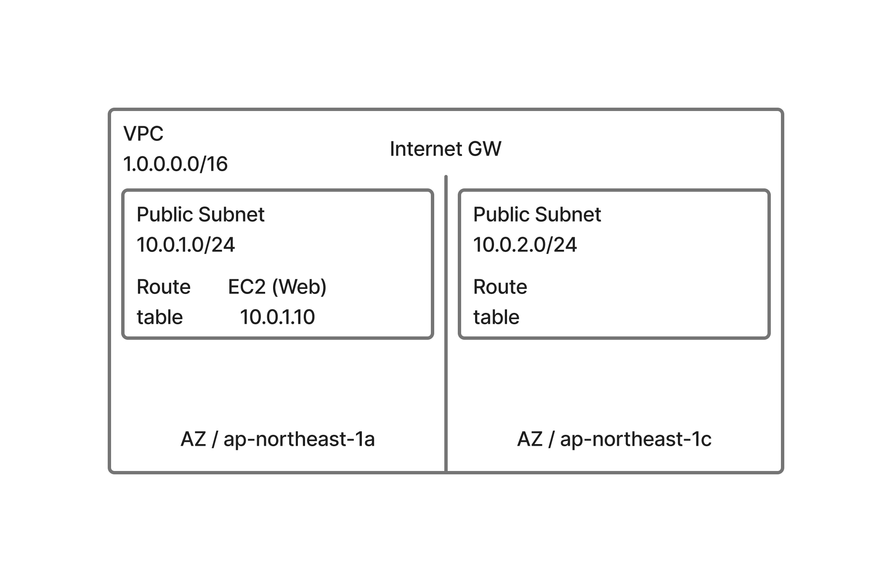
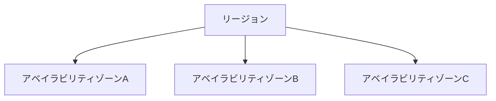
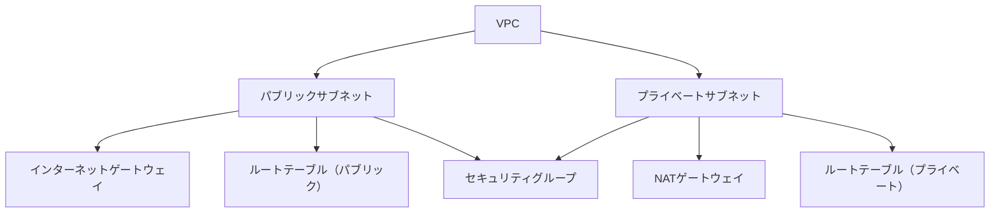

# June 2025 TIL (Today I Learned)

This file contains things I learned during June 2025.

---

## 2025-06-23: CSSの:has()擬似クラス

ネタがあまりないので、知ってるけどユースケース深めたいCSS指定について。

CSSの`:has()`は「親要素が特定の子要素を持つ場合にスタイルを適用できる」新しい擬似クラス。

親セレクタとして使えるため、従来より柔軟なデザインが可能。

### 例

```css
/* input:invalid を含むフォームだけ赤枠 */
form:has(input:invalid) {
  border: 2px solid red;
}

/* 画像を含むカードだけ影を付ける */
.card:has(img) {
  box-shadow: 0 2px 8px #0002;
}

/* チェック済みのliだけ色を変える */
li:has(input[type='checkbox']:checked) {
  background: #e0ffe0;
}

/* 入力済みinputがあるときだけ送信ボタンを有効化 */
form:has(input:not(:placeholder-shown)) button[type='submit'] {
  opacity: 1;
  pointer-events: auto;
}
form button[type='submit'] {
  opacity: 0.5;
  pointer-events: none;
}

/* 画像を含まないカードだけグレー背景 */
.card:not(:has(img)) {
  background: #f0f0f0;
}

/* チェックされていないliだけ色を変える */
li:not(:has(input[type='checkbox']:checked)) {
  background: #ffe0e0;
}
```

### 参考

- [MDN: :has()](https://developer.mozilla.org/en-US/docs/Web/CSS/:has)
- [MDN: :invalid](https://developer.mozilla.org/en-US/docs/Web/CSS/:invalid)
- [MDN: :not()](https://developer.mozilla.org/en-US/docs/Web/CSS/:not)

---

## 2025-06-22: AWS 14 days - Day 4

Day 3までで、Web用のEC2インスタンスを立て、ApacheをインストールしてWebサーバーを構築した。

Day 4では、DB用のEC2インスタンスを立て、MySQLをインストールしてDBサーバーを構築する。

どういった構成になるかを言語化すると、以下の通りになる。

### 全体構成

- リージョン: 東京リージョン（ap-northeast-1）
- VPC: 10.0.0.0/16
- インターネットゲートウェイ (Internet GW) がVPCにアタッチされている

### サブネットとAZ（アベイラビリティゾーン）

- AZ ap-northeast-1a
  - Public Subnet: 10.0.1.0/24
    - ルートテーブルあり
    - EC2（Webサーバ）: 10.0.1.10
  - Private Subnet: 10.0.101.0/24
    - ルートテーブルあり
    - EC2（DBサーバ）: 10.0.101.20
- AZ ap-northeast-1c
  - Public Subnet: 10.0.2.0/24
    - ルートテーブルあり
    - EC2インスタンスの記載はなし
  - Private Subnet: 10.0.102.0/24
    - ルートテーブルあり
    - EC2インスタンスの記載はなし

### その他の特徴

- パブリックサブネットはインターネットゲートウェイ経由で外部アクセスが可能（Webサーバを設置）。
- プライベートサブネットはDBサーバ等、外部から直接アクセスしないリソースを配置。
- 各サブネットには個別のルートテーブルが関連付けられている。
- サブネットごとにCIDRブロックが異なる。
- 2つのAZにまたがって冗長化を意識した構成（片方にはリソース未配置だが、拡張可能）。

### まとめ

- **2つのAZ（ap-northeast-1a, 1c）**に、パブリック/プライベートサブネットを1つずつ配置
- Webサーバはパブリックサブネット、DBサーバはプライベートサブネット
- インターネットアクセスはパブリックサブネット経由
- 今後の可用性・冗長化に対応しやすいベーシックな2層構成

---

## 2025-06-21: AI Fluency - The AI Fluency Framework

Anthropicの「AI Fluency Framework」について学んだ。AI
Fluencyとは、AIを効果的・効率的・倫理的・安全に活用する能力を指す。

### AIとの関わり方の3パターン

- **Automation（自動化）**

  - 明確な指示やルールに基づき、AIがタスクを自動で実行する。
  - 例：定型レポートの自動生成、データ入力の自動化など。

- **Augmentation（拡張）**

  - 人間とAIが協力し合い、互いの強みを活かして成果を高める。
  - 例：AIがアイデア出しや分析をサポートし、人間が最終判断を行う。

- **Agency（自律性）**

  - AIが人間の代理として、ある程度自律的に意思決定や行動を行う。
  - 例：AIエージェントが自動で顧客対応やプロジェクト管理を行う。

多くの場合はAutomationから始めるが、AugmentationやAgencyも組み合わせることで、より創造的かつ高度なAI活用が可能になる。

### AI Fluencyを支える「4D」フレームワーク

AI Fluencyを高めるための4つの重要なスキル：

- **Delegation（委任）** AIに任せるべきタスクと、人間が担うべきタスクを適切に見極める力。

- **Description（記述）** AIに対して目的や期待、基準を明確に伝え、効果的に指示・コミュニケーションする力。

- **Discernment（識別）** AIの出力や提案を批判的に評価し、信頼性や妥当性を判断する力。

- **Diligence（慎重さ・責任感）** AIとのやりとりや成果物に対して、継続的に注意を払い、責任を持って活用・改善する力。

#### 具体例（プロジェクト別の4D活用）

- **コミュニケーションプロジェクト**

  マーケティングメールの下書きをAIと協力して作成する場合：

  - Delegation: どの部分をAIに任せ、どこを自分で担当するか？
  - Description: キャンペーンの目的やトーン、成功基準をどうAIに伝えるか？
  - Discernment: AIが作成したメールが要件を満たしているか、どう評価するか？
  - Diligence: 透明性や責任をどう担保するか？

- **リサーチプロジェクト**

  論文用のデータ分析をAIに手伝ってもらう場合：

  - Delegation: 分析作業をどう分担するか？
  - Description: 研究課題や背景をどうAIに説明するか？
  - Discernment: AIの分析結果の正確性をどう検証するか？
  - Diligence: AI活用に伴う倫理的配慮は？

- **クリエイティブプロジェクト**

  物語のキャラクター設定をAIと共創する場合：

  - Delegation: どの創作要素をAIと協力し、どこを自分で作るか？
  - Description: 世界観やキャラクター像をどうAIに伝えるか？
  - Discernment: AIの提案から何を採用・修正・却下するか？
  - Diligence: AIの貢献をどう認識・明示するか？

### 参考

- [AI Fluency: The AI Fluency Framework](https://www.anthropic.com/ai-fluency/overview)

---

## 2025-06-20: AI Fluency - Introduction to AI Fluency

今日は「AI
Fluency」について学んだ。これは単なるAIツールの使い方ではなく、AIとの協働を通じて価値を生み出すための包括的なスキルセットだ。

### AI Fluencyの定義と目的

> AI Fluency: it is the ability to collaborate with AI in ways that are effective, efficient, ethical, and safe.

AI Fluencyとは、効果的、効率的、倫理的、そして安全な方法でAIと協働する能力のこと。これは：

- ツールとしてのAIを使いこなす以上に、人間とAIの協働を通じてより良い成果を出すための能力
- AI技術の急速な進化に対応し、将来も通用するスキルを身につけるための枠組み

### AI Fluencyを構成する"4D"フレームワーク

AI Fluencyは4つの核となる能力（"4D"）から成り立っている：

1. **Delegation（委任）**: AIにタスクを効果的に任せる能力

   - AIの得意・不得意を理解し、適切なタスク割り当てを行う
   - 人間が行うべき判断とAIに任せられる作業を見極める

2. **Description（記述）**: AIに明確に指示を出す能力

   - 明確で具体的な指示を与え、期待する結果を得る
   - プロンプトエンジニアリングや効果的な質問設計ができる

3. **Discernment（識別）**: AIの出力を評価・判断する能力

   - AIの回答が正確か、信頼できるか、有用かを判断する
   - 出力の限界を理解し、適切に検証・修正できる

4. **Diligence（勤勉）**: AIとの協働を継続的に改善する能力
   - AIとの対話から学び、フィードバックループを作る
   - より良い結果を得るためのプロセスを最適化し続ける

### 自分自身の振り返りと課題

AI Fluencyに関する自己評価と今後の目標：

**現在の課題**:

- AIの活用場面の見極めが難しい
  - どんな場面でAIを使うのが適切か、任せるべきタスクとそうでないタスクの線引きがまだ曖昧
  - AIを利用したワークフローが確立されておらず、探り探り進めている状態
  - 現状は「悩みが明確になったらAIに相談する」というシンプルなパターンが中心

**期待する可能性**:

- 自分自身のアイデアの具現化プロセスの加速
- AIとの協働によって、より早く多くの質の高いアウトプットを生み出せる

**この学習から得たいもの**:

- AIを使いこなすための体系的なスキルセットの習得
  - 特に、AIとの効果的なコミュニケーションや協働の方法を実践的に学びたい
- AIを活用する場面の明確化と、持続可能なワークフローの確立

### Reference

- [AI Fluency - Introduction to AI Fluency](https://www.anthropic.com/ai-fluency)

---

## 2025-06-19: 9 NEW JavaScript Features in ES2025

[9 NEW JavaScript Features in ES2025](https://youtu.be/1-cjrEMj_us)を見て、ES2025の新機能をまとめる。

### `Set`

```js
const activeUsers = new Set(['alice', 'bob', 'charlie']);
const adminUsers = new Set(['alice', 'dave', 'eve']);

const activeAdmins = new Set([...activeUsers].filter(user => adminUsers.has(user)));
console.log('🚀 ~ activeAdmins:', activeAdmins); // [ '🚀 ~ activeAdmins:', Set { 0: 'alice' } ]

const activeNonAdmins = new Set([...activeUsers].filter(user => !adminUsers.has(user)));
console.log('🚀 ~ activeNonAdmins:', activeNonAdmins); // [ '🚀 ~ activeNonAdmins:', Set { 0: 'bob', 1: 'charlie' } ]

const isAllAdminsActive = [...adminUsers].every(user => activeUsers.has(user));
console.log('🚀 ~ isAllAdminsActive:', isAllAdminsActive); //  '🚀 ~ isAllAdminsActive:', false ]
```

ES2025では、`Set` に対して `intersection()`, `union()`, `difference()`, `isSubsetOf()`
といった便利な集合演算メソッドが追加された。

これまで冗長だった書き方が、より直感的で読みやすくなる。

```js
const activeUsers = new Set(['alice', 'bob', 'charlie']);
const adminUsers = new Set(['alice', 'dave', 'eve']);

const activeAdmins = activeUsers.intersection(adminUsers);
console.log('🚀 ~ activeAdmins:', activeAdmins); // [ '🚀 ~ activeAdmins:', Set { 0: 'alice' } ]

const activeNonAdmins = activeUsers.difference(adminUsers);
console.log('🚀 ~ activeNonAdmins:', activeNonAdmins); // [ '🚀 ~ activeNonAdmins:', Set { 0: 'bob', 1: 'charlie' } ]

const isAllAdminsActive = activeUsers.isSubsetOf(adminUsers);
console.log('🚀 ~ isAllAdminsActive:', isAllAdminsActive); //  '🚀 ~ isAllAdminsActive:', false ]
```

<https://developer.mozilla.org/en-US/docs/Web/JavaScript/Reference/Global_Objects/Set>

### `RegExp.escape()`

正規表現の中でユーザー入力などをそのまま使うと、意図しないマッチングが発生することがある。

`RegExp.escape()`は、文字列を安全に正規表現に埋め込むための便利な関数。

```js
const userInput = 'hello. (world)?';
const safe = RegExp.escape(userInput); // 'hello\\. \$begin:math:text$world\\$end:math:text$\\?'
const regex = new RegExp(safe);
console.log(regex.test('hello. (world)?')); // true
```

<https://developer.mozilla.org/en-US/docs/Web/JavaScript/Reference/Global_Objects/RegExp/escape>

### RegExp Modifiers

v フラグが導入され、正規表現の一部にだけモディファイア（修飾子）を適用できるようになる。

特に大規模なパターンを構築する際に有効。

```js
const regex = /(?mod-i:HELLO)/v;
console.log(regex.test('hello')); // true
```

※ (?mod-i:...) の中だけ i（大文字・小文字を無視）が有効。

<https://github.com/tc39/proposal-regexp-modifiers>

### Duplicate Named Capturing Groups

これまでは同じ名前のキャプチャグループを複数使えなかったが、ES2025では可能になり、柔軟なマッチングが書きやすくなる。

d フラグで複数キャプチャの区別ができる。

```js
const re = /(?<word>\w+)-(?<word>\w+)/d;
const match = re.exec('foo-bar');
console.log(match.groups.word); // ['foo', 'bar']
```

<https://github.com/tc39/proposal-duplicate-named-capturing-groups>

### Import Attributes

ES2025では、import に with を付けて属性を指定できるようになる。

これはJSONやWASMなどのモジュールを明示的に読み込むときに便利。

```js
import config from './config.json' with { type: 'json' };
console.log(config.apiKey);
```

ビルドツールやブラウザがファイルの型を正しく判別する助けになる。

<https://developer.mozilla.org/en-US/docs/Web/JavaScript/Reference/Statements/import/with>

### `Array.prototype.groupBy()`

配列をキーごとにグループ化（これはES2024で追加済み）

```js
const users = [
  { name: 'Alice', age: 25 },
  { name: 'Bob', age: 30 },
  { name: 'Charlie', age: 25 },
];

const groupedByAge = users.groupBy(user => user.age);

console.log(groupedByAge);
// {
//   '25': [{ name: 'Alice', age: 25 }, { name: 'Charlie', age: 25 }],
//   '30': [{ name: 'Bob', age: 30 }]
// }
```

### まとめ

- Set の拡張はユースケースが多く、可読性・意図の明示性の両面で大きな前進。
- 正規表現関連（escape, modifiers, duplicate groups）の機能拡張が強力。ユーザー入力の安全性や柔軟なパターン構築に有用。
- import attributes は今後のモジュール設計に大きな影響を与えそう。
- groupBy はデータ処理の効率化に寄与。特に集計や分析系のアプリケーションで活躍しそう。

---

## 2025-06-18: AWS 14 days - Day 3 (2)

### 構成図

今までで、VPC上でEC2インスタンスを立て、ApacheをインストールしてWebサーバーを構築したので、構成図をまとめておく。



### よく使うAWS CLIコマンド

CloudShell上でよく使うAWS CLIコマンドをまとめておく。

- **AWS CLIのインストール**: CloudShellにはデフォルトでインストールされている。
- **AWS CLIのバージョン確認**: `aws --version`
- **AWS CLIの設定**: `aws configure` でアクセスキー、シークレットキー、リージョン、出力形式を設定。
- **AWS CLIのヘルプ表示**: `aws help` または `aws <service> help` で特定サービスのヘルプを表示。

- コマンドで設定ファイルを確認: `ll`
- パッケージ一覧を確認、所望のパッケージを見つける: `dnf list --installed | grep <キーワード>`
- パッケージを更新: `sudo dnf update -y`
- パッケージをインストール: `sudo dnf install -y <パッケージ名>`
- ホスト名
  - 確認: `hostnamectl`
  - 変更: `sudo hostnamectl set-hostname <新しいホスト名>`
- ロケールやキーボード設定の確認・変更
  - 確認: `localectl status`
  - 変更: `sudo localectl set-locale LANG=ja_JP.UTF-8`
    - 変更したらパスを通す: `source /etc/locale.conf`
- タイムゾーンの確認・変更
  - 確認: `timedatectl`
  - 変更: `sudo timedatectl set-timezone Asia/Tokyo`
- サービスの管理
  - サービスの状態確認: `systemctl status <サービス名>`
  - サービスの起動: `sudo systemctl start <サービス名>`
  - サービスの停止: `sudo systemctl stop <サービス名>`
  - サービスの再起動: `sudo systemctl restart <サービス名>`
  - サービスの有効化（自動起動設定）: `sudo systemctl enable <サービス名>`
  - サービスの無効化（自動起動解除）: `sudo systemctl disable <サービス名>`
- CloudShellを終了: `exit`

---

## 2025-06-17: Model Context Protocol（MCP）by Anthropic

[MCPの解説](https://youtu.be/CQywdSdi5iA)を開発元のAnthropicが出していたので、その内容をまとめる。

### ✅ MCP is 何？

💬 簡単に言うと…

MCP（Model Context Protocol）は、「AIとAIの会話をもっとスムーズにするための共通ルール（プロトコル）」です。

たとえば、あなたが何か質問して、それを複数のAIが協力して答える時、AI同士が「今の会話の流れ」「ユーザーの意図」「関連情報」をきちんと伝え合わないと、変な答えになりますよね。MCPは、そうした**“会話の文脈”をAI同士で共有するためのフォーマット**を定義しています。

📦 MCPが解決すること：

- AI間のやりとりに統一されたデータ形式を与える
- モデルが違っても、前後の流れ（context）を共有できる
- ひとつのアプリで複数のAIを組み合わせて使える

### 📌 重要論点 10個

1. MCPの目的は「モデル間で文脈（コンテキスト）を共有する標準を作る」こと。
2. メッセージ構造は送信者、受信者、内容、タイムスタンプなどを含む。
3. マルチエージェント協調をサポート。複数AIが連携して処理を行える。
4. アプリケーションからモデルへのコンテキスト渡しが容易になる。
5. **ステートフルな会話（履歴を保つ）**が可能。セッションの状態を追跡できる。
6. モデルの入れ替えがしやすくなる。プロトコル準拠なら差し替えても動く。
7. 開発者間の共通理解・再利用性が高まり、AIアプリの開発速度が向上。
8. GitHub上で仕様がオープン公開されており、コミュニティで改善されている。
9. セキュリティ／プライバシーの考慮も重要な設計課題の一つ。
10. 今後のAIプラットフォームの基盤技術として、採用が広がる可能性がある。

### 🔑 キーワード集（＋簡単な説明）

- MCP (Model Context Protocol)
  - モデル間で「文脈あるやりとり」をするための通信規格
- Context (コンテキスト)
  - 会話や処理の流れ・前後関係・ユーザー意図などの情報
- Message (メッセージ)
  - MCPでやり取りされる単位。誰が何を送ったかなどを含む
- Sender / Receiver
  - 送信者（AIやユーザー）と受信者（他のAIなど）
- Agent (エージェント)
  - ある役割を持ったAIモデル。複数エージェントの協調が可能
- Session
  - 1つの会話や処理のまとまり。履歴・状態を記録する単位
- Metadata
  - タイムスタンプや関連リンクなど、補足情報
- Interoperability
  - モデル同士の相互運用性。MCPがそれを支える
- Standardization
  - 標準化。開発者や企業が共通のルールで開発できるようにする
- Open Source
  - MCP仕様はGitHub上で誰でも閲覧・改善可能な状態で公開

### 参考リンク

- [Model Context Protocol (MCP) - 公式サイト](https://modelcontextprotocol.io)
- [Model Context Protocol (MCP) - GitHub](https://github.com/modelcontextprotocol)
- [The Model Context Protocol (MCP)](https://youtu.be/CQywdSdi5iA)

---

## 2025-06-16: AWS 14 days - Day 3

### リージョン

AWSのサービスは、世界中に分散した「リージョン」と呼ばれるデータセンターのまとまりで提供されている。

各リージョンは独立していて、地理的に離れた場所に配置されている。そのため、災害対策やレイテンシ（遅延）の低減に役立つ。

#### リージョンの選び方

- **地理的要件**: ユーザーに近いリージョンを選ぶと、通信の遅延が少なくなる。
- **法的要件**: データの保存場所に関する法律や規制も考慮する。
- **サービスの可用性**: 一部のAWSサービスは特定リージョンでしか使えない場合があるので、必要なサービスがあるか確認する。
- **コスト**: リージョンごとに料金が違うので、コストも比較する。

#### リージョンとゾーンの関係



### ゾーン（アベイラビリティゾーン/AZ）

1つのリージョンの中には、複数の「アベイラビリティゾーン（AZ）」がある。

AZは、独立した電源やネットワークを持つデータセンターの集まり。同じリージョン内で高い可用性（障害に強い仕組み）を実現する。

#### ゾーンの使い方

- **高可用性**: アプリケーションを複数のAZに分散して配置すると、1つのAZが障害になってもサービスを継続できる。
- **負荷分散**: トラフィックを複数のAZに分けて、パフォーマンスを上げる。
- **データの冗長化**: データベースやストレージをマルチAZ構成にすると、データの可用性が高まる。

#### マルチAZ構成

異なるAZにリソースを配置することで、障害発生時の影響を最小限にできる。

たとえば、RDSやElastiCacheなどのデータベースサービスは、マルチAZ構成で高可用性を実現できる。

### VPC（Virtual Private Cloud）

VPCは、AWS上に自分専用の仮想ネットワークを作るサービス。

VPCを使うと、IPアドレス範囲やサブネット、ルートテーブル、セキュリティグループなどを自由に設定できる。

#### VPCの構成イメージ



#### サブネット

サブネットは、VPC内のIPアドレス範囲をさらに分割したもの。

- **パブリックサブネット**: インターネットから直接アクセスできる。Webサーバーやロードバランサーを置く。
  - インターネットゲートウェイ経由で外部と通信。
- **プライベートサブネット**: インターネットから直接アクセスできない。データベースやアプリケーションサーバーなど、外部公開しないリソースを置く。
  - NATゲートウェイ経由で外部APIなどにアクセス。

AZごとにサブネットを作り、リソースを分散配置することで、可用性やセキュリティを高められる。

#### ルートテーブル

ルートテーブルは、VPC内の通信経路（ルーティング）を決めるもの。

- **インターネットゲートウェイ**: パブリックサブネットからインターネットへ出るための経路。
- **NATゲートウェイ**: プライベートサブネットからインターネットへ出るための経路（外部API利用など）。

#### セキュリティグループ

セキュリティグループは、VPC内のリソースへのアクセスを制御するファイアウォール。

- **インバウンドルール**: 外部からインスタンスへのアクセスを許可するルール（IPやポート単位で設定）。
- **アウトバウンドルール**: インスタンスから外部へのアクセスを許可するルール。

### VPCの設定手順（基本の流れ）

1. **VPCの作成**: AWSマネジメントコンソールからVPCを作る
2. **サブネットの作成**: パブリックサブネットとプライベートサブネットを作る
3. **インターネットゲートウェイの設定**: パブリックサブネットにインターネットゲートウェイを接続
4. **NATゲートウェイの設定**: プライベートサブネットにNATゲートウェイを接続
5. **ルートテーブルの設定**: 各サブネットに適切なルートテーブルを設定
6. **セキュリティグループの設定**: インスタンスごとにセキュリティグループを設定し、アクセス制御を行う

---

## 2025-06-15: AWS 14 days - Day 2

### Amazon EC2とは？

Amazon EC2（Elastic Compute Cloud）は、AWSが提供する「必要なときに必要なだけ使える」仮想サーバーサービス。

物理サーバーを自分で用意することなく、Web画面から簡単にサーバー（インスタンス）を作成・削除できる。

主な特徴は以下の通り：

- 必要なときにすぐサーバーを作れる（オンデマンド）
- CPUやメモリなどのスペックを自由に選べる
- LinuxやWindowsなど好きなOSを選べる
- 使った分だけ料金が発生（秒単位の従量課金）

### EC2インスタンスを作る流れ

1. **インスタンスの起動** AWSマネジメントコンソールのEC2ダッシュボードから「インスタンスの起動」を選ぶ。
2. **AMI（Amazon Machine Image）の選択** Amazon LinuxやUbuntuなど、使いたいOSや初期設定が入ったイメージ（AMI）を選ぶ。
3. **インスタンスタイプの選択** CPUやメモリなどのスペックを選ぶ。t3.microは無料利用枠の対象。
4. **詳細設定** VPC（仮想ネットワーク）やサブネット、IAMロールなどを設定します。初心者はデフォルトのままでOK。
5. **ストレージの設定** デフォルトのEBS（仮想ディスク）サイズを確認・変更できます。必要なら追加も可能。
6. **タグの追加** インスタンスに名前などのタグを付けて管理しやすくする。
7. **セキュリティグループの設定**
   インスタンスへのアクセスを制御するファイアウォール。SSH（22番）やHTTP（80番）など必要なポートを開ける。
8. **キーペアの選択** SSH接続用のキーペアを新規作成または既存から選ぶ。新規作成時は必ずダウンロードして保管する。
9. **起動** 設定内容を確認し、インスタンスを起動する。

### EC2インスタンスへの接続方法

インスタンスが起動したら、公開IPアドレスを使ってSSHで接続する。

```sh
ssh -i /path/to/your-key.pem ec2-user@インスタンスのパブリックIP
```

もし「WARNING: UNPROTECTED PRIVATE KEY FILE!」と表示された場合は、キーペアの権限を変更する。

```sh
chmod 400 /path/to/your-key.pem
```

接続できたら、Amazon Linuxなどのログイン画面が表示される。

### Apacheのインストール例

```sh
sudo dnf update -y
sudo dnf install httpd
dnf list --installed | grep httpd
```

HTTP（80番）ポートを開放していれば、インスタンスのパブリックIPにブラウザでアクセスすると「It works!」と表示される。

### AMIの作成と利用

- **AMI（Amazon Machine Image）**は、EC2インスタンスの状態（OSやアプリ、設定）を丸ごと保存したイメージ。
- 作成したAMIから新しいインスタンスを複製できる。
- **EBSスナップショット**は、EBS（仮想ディスク）のバックアップです。AMI作成時に自動でスナップショットも作られる。

### Elastic IPアドレスの利用

- **Elastic IPアドレス**は、AWSが提供する固定のグローバルIPv4アドレス。
- インスタンスに割り当てることで、再起動や停止・起動後も同じIPアドレスを使い続けられる。

### 用語解説と関連性

#### EC2（Elastic Compute Cloud）

AWSの仮想サーバーサービス。必要なときに仮想マシン（インスタンス）を作成・削除できる。

#### インスタンス

EC2で作成される仮想サーバー1台1台のこと。OSやスペック、ネットワーク設定などを持つ。

#### AMI（Amazon Machine Image）

インスタンスの「設計図」。OSやアプリ、設定をまとめたイメージファイル。AMIから何台でも同じ構成のインスタンスを作れる。

#### Elastic IP

AWSが提供する固定グローバルIPアドレス。インスタンスに割り当てて、IPアドレスを固定できる。

#### それぞれの関連性

- **AMI**はインスタンスを作るための「元データ」。
- **インスタンス**はAMIから作られる「実体」。
- **Elastic IP**はインスタンスに「固定の住所」を割り当てるもの。

---

## 2025-06-14: AWS 14 days - Day 1

### AWSアカウントの基本

- AWSアカウントはリソースの論理的なまとまり。プロダクトや環境ごとに分けるのが一般的で、単位ごとに利用料が請求される。
  - 例：ECサイト（本番／テスト／開発）、管理サイト（本番／テスト／開発）

### AWS料金の管理

- 各サービスの利用料金は公式Webサイトで確認できる。無料利用枠や見積もり機能も活用可能。
- 予算アラートを設定しておくと、予算超過時に通知が届く。
- 支払い方法（法人カード、請求書払い等）は事前に整理しておくとよい。

### ユーザー管理

- ルートユーザー：全権限を持つ特権ユーザー。アカウント設定やサポートプラン変更時のみ使用。
- IAMユーザー：通常の利用者。個別にアクセス権限を設定し、APIアクセス用のキーも発行できる。日常業務はIAMユーザーで行う。

### セキュリティ初期設定

- AWS CloudTrail：操作ログを記録するサービス。デフォルト有効。S3に証跡を保存可能。
- Amazon GuardDuty：脅威検出サービス。悪意あるアクティビティを監視し、SNS通知も設定できる。
- より詳しくはAWS Well-Architected Frameworkの「セキュリティの柱」を参照。

---

## 2025-06-13: どんな時にAIエージェントにコードを書かせるべきか？

どんな前提があり、どんなユースケースがあるのかを整理してみた。

ユースケースの以前に、AIエージェントにコードを書かせる大前提としては以下の通り：

- どのように実装すればよいかを理解していること
- 実装しようとしている機能やコードが、コアなビジネスロジックではないこと
- セキュリティの観点から、AIエージェントに任せることが許容される範囲であること
- 導入するアルゴリズムがよく知られているものであり、AIエージェントが適切に学習していること
- コードベースに十分な「基礎」があり、AIエージェントが学習するための情報が豊富であること

次に、主なユースケースは以下の通り：

- 反復的・定型的なコードやテンプレートの自動生成
- ドキュメントやテストコードの生成・更新
- コードレビューやリファクタリング、バグ修正、最適化の補助
- プロトタイピングや新技術の検証
- コードの翻訳・依存管理・セキュリティチェックなど、機械的な作業の自動化

このような作業はAIの活用によって効率化・品質向上が期待できる。

### 参考リンク

- [When should you let AI write your code?](https://youtu.be/ADF_4PAqWrI)

---

## 2025-06-12: UnJSというJavaScriptツール・ライブラリ郡

- UnJSは Unified JavaScript を目指した、軽量・単一目的・ランタイム非依存の JavaScriptツール／ライブラリ群
- 公式サイトにもあるとおり、UNIXフィロソフィーに倣い、各パッケージは「素早く」「理解しやすく」「洗練された」機能に絞って設計されている
- Node.jsやブラウザ、Deno、Cloudflare Workersなどさまざまな環境でシームレスに使えるように作られている

### 主要コンセプト

- 単一目的（Single-Purpose）：各パッケージが特定の機能に特化し、小さく、高品質。
- ランタイム・フレームワーク非依存（Agnostic & Compatible）：どの環境やツールとも組み合わせて使えるように設計。
- コミュニティ重視：オープンで歓迎的な貢献環境。
- 一貫性：命名・API設計に統一感があり、相互に補完しやすい 。

### パッケージ群（一部例）

公式には約63個のパッケージがあり、以下のものがよく使われる：

- ofetch：Node／ブラウザ／Worker対応の強化された fetch API。JSON自動解析・ストリーム・バイナリ対応等。
- unhead：全フレームワーク対応の <head> タグマネージャー。軽量・SSR／SEO最適化機能あり。
- unbuild：TypeScript／E‑SM対応の統一ビルドシステム。複数フォーマット生成や型定義付き。
- unenv：Node／ブラウザ／エッジなど環境間の互換性を提供するユーティリティ。
- unstorage：ランタイムを問わない汎用キー・バリュー・ストレージ API。メモリ／ファイル／Redisなど20以上のドライバー対応。

### メタパッケージ：unkit

unkit は、UnJS の人気ユーティリティパッケージをひとまとめにした“標準ライブラリ的”なもの。

unkit/env, /string, /fetch などのサブパスから必要な機能だけをインポートでき、簡単に導入できる。

### まとめ

- UnJS は、軽量で単機能、環境を問わず再利用しやすいJSモジュール群を集めたエコシステム
- コミュニティ全体でパズルのピースのようにつながる設計なので、必要な機能だけ選んで使いながら、後から拡張していけるのが魅力
- 現代的なJS開発に必要なツールが揃っており、さっと導入して本格的な開発にも耐える柔軟性がある

---

## 2025-06-11: TanStack Routerの紹介ブログ読んだ

Routerを選ぶのは最も重要な設計判断の一つであり、Routerはアプリケーションの構造やデータフローに大きな影響を与える。

TkDodo's blogでのTanStack Routerの紹介
["The Beauty of TanStack Router"](https://tkdodo.eu/blog/the-beauty-of-tan-stack-router)
が非常に興味深かったので、要点をまとめる。

### Type-Safeルーティング

TanStack Routerは最初からTypeScriptを念頭に設計。

ルートごとのパラメータを厳格に型チェックでき、`useParams({ from: … })`を使えば、そのルートに紐づく型が返される。

`strict: false`を使えば、複数ルートにまたがるユニオン型も安心して扱える。

さらに、`<Link>`コンポーネントでも、存在しないパスや不足するパラメータなどがある場合、型エラーで検出できるようになっている。

### 検索パラメータの型付けとバリデーション

従来のURLSearchParamsは型安全とは程遠いでが、TanStack
Routerでは、ルート定義でスキーマ（例：Arktype）を与えることで、検索パラメータの入力・パース・シリアライズ・構造共有まで自動で処理される。

### サブスクライブの粒度が細かい

URLやルートの更新によって、関係ないコンポーネントまで再描画されてしまう問題を防ぐため、`useSearch`・`useParams`・`useLoaderData`などには`select`オプション（セレクタ機能）があり、関心のある一部だけを追跡することで再レンダリングを抑止可能。

### ファイルベースとコードベースのハイブリッドルーティング

従来の宣言型ルーティングは可読性や保守性に課題があるが、TanStack
Routerは「ファイルシステム構造＝ルート構成」を採用しつつ、必要に応じてコードベースでも定義可能。

これにより、URL→コードのマッピングが明確になり、モノレポでも扱いやすくなっている。

### Suspense & エラーバウンダリ対応

すべてのルートはデフォルトで`<Suspense>`と`<ErrorBoundary>`に包まれている。

`useSuspenseQuery`を使ってローダーにクエリを組み込めば、フェッチ完了までコンポーネントはレンダリングされず、シンプルに考慮事項が少なくなり実装がラク。

### React Transitionsとの連携

遷移は`startTransition`でラップされており、状態管理は`useSyncExternalStore`によって細かく最適化されています。

現時点ではconcurrent storeがないため一部制限はありますが、今後強化される予定とのこと。

### その他の改善点

- Route Context, ネストルート, TanStack Query統合, Searchミドルウェア, SSR対応（TanStack
  Start） など、今後続々と詳細が公開される予定。
- 「一度使うと他のルーターに戻れない」とまで言われるほどの開発者体験（DX）と型安全性を誇る。

### まとめ

TanStack Router は、以下の特長を兼ね備えた「モダンなルーティングライブラリ」：

- 完全なTypeScript対応と厳密な型安全性
- 検索パラメータのバリデーションと型付け
- 再描画を最小化する設計
- ファイルとコード両対応型ルーティング
- SuspenseやReact Transitionsの統合
- SSRやモノレポへの対応にも強く、拡張性・保守性も抜群

---

## 2025-06-10: Zod v4の主な新機能と実践的な活用法

Zod v4がリリースされ、TypeScript向けの型安全なバリデーションライブラリとして、実用性と開発体験が大きく向上した。

ここでは、v4で追加・強化された主な機能と、その実践的な使い方・メリットを整理する。

### 主な新機能・改善点

- **エラー出力の強化**: バリデーションエラーの整形・集約が簡単に
- **`stringbool`型の追加**: 文字列で受け取った真偽値を安全に扱える
- **APIの一貫性・型推論の向上**: より直感的な型定義と推論が可能に

### 1. エラー出力の強化（pretty-printing, flatten）

従来はZodErrorの`issues`配列を手作業で整形していたが、v4では`z.prettifyError`や`z.flattenError`により、エラー内容を簡潔かつ分かりやすく取得できる。

#### フォームバリデーションの例

**従来:**

```ts
const statusMessage = error.issues.map(issue => `${issue.path.join('')}: ${issue.message}`).join('; ');
const data = error.issues.reduce(
  (errors, issue) => {
    errors[issue.path.join('')] = issue.message;
    return errors;
  },
  {} as Record<string, string>
);
```

**v4以降:**

```ts
const statusMessage = z.prettifyError(error);
const data = z.flattenError(error).fieldErrors;
```

これにより、エラー処理の実装が大幅に簡素化され、保守性も向上する。

#### 環境変数バリデーションの例

**従来:**

```ts
if (error instanceof ZodError) {
  let message = 'Missing required values in .env:\n';
  error.issues.forEach(issue => {
    message += `${issue.path[0]}\n`;
  });
  throw new Error(message);
}
```

**v4以降:**

```ts
if (error instanceof z.ZodError) {
  let message = 'Missing required values in .env:\n';
  message += Object.keys(z.flattenError(error).fieldErrors).join('\n');
  throw new Error(message);
}
```

### 2. `stringbool`型の追加

環境変数やフォーム値など、`"true"`/`"false"`の文字列をboolean型として安全に扱いたいケースで、従来は`transform`や`coerce`を駆使していた。

**従来:**

```ts
const stringBoolean = z.coerce
  .string()
  .transform(val => val === 'true')
  .default('false');
```

**v4以降:**

```ts
const stringBoolean = z.stringbool();
```

これにより、boolean値のバリデーション・変換がより直感的かつ安全に記述できる。

### 3. その他の改善点

- 型推論の精度向上やAPIの一貫性強化
- flatten/mergeなどユーティリティ関数の追加
- ドキュメントやエラーメッセージの改善

### まとめ

Zod
v4は、バリデーションエラーの扱いや真偽値の変換など、日常的な型バリデーションの実装をよりシンプルかつ堅牢にしてくれる。

既存プロジェクトでも、エラー処理や環境変数バリデーションの記述をv4流にリファクタリングすることで、保守性・可読性が大きく向上する。

### 参考リンク

- [Zod v4公式ドキュメント](https://zod.dev/v4)
- [Zod GitHubリリースノート](https://github.com/colinhacks/zod/releases)

---

## 2025-06-09: VS CodeでコミットメッセージをAI自動生成する方法まとめ

JetBrains IDE以外で、**VS CodeでコミットメッセージをAI生成したい**場合の選択肢・使い分け・注意点を整理。

### 1. GitHub Copilotによるコミットメッセージ生成

- **使い方**: 変更をステージ後、Source Controlビューのコミットメッセージ欄右上の ✨（sparkles）ボタンをクリック。
- **仕組み**: ステージ済みの差分（diff）のみをOpenAIモデルに送信し、Conventional Commits形式で要約・提案される。
- **生成例**:

  ```text
  feat: add user authentication logic

  - implement login and logout features
  - add JWT token handling
  - update user model and tests
  ```

- **セキュリティ**: 差分のみ送信されるため、未ステージのファイルや他の情報は送信されない。
- **導入方法**: Copilot Chat拡張（v0.22以降）をインストールすれば利用可能。

### メリット

- 導入が非常に簡単（拡張機能を入れるだけ）
- 差分のみ送信で情報漏洩リスクが低い
- Conventional Commits形式で統一感のあるメッセージ
- 1クリックで完結、学習コストほぼゼロ

### デメリット

- GitHub Copilotの有料サブスクリプションが必要
- オフラインでは利用不可
- 英語メインの提案が多い（日本語化は手動修正が必要な場合あり）

### 2. GitLens (GitKraken AI)によるコミットメッセージ生成

- **使い方**: 変更をステージ後、Source Controlパネル上部の **Generate Commit Message (AI)**
  ボタン、またはコマンドパレットから`GitLens: Generate Commit Message with AI`を実行。
- **仕組み**: ステージ済み差分をAI（GitKrakenのクラウドサービス）に送信し、先頭行にサマリー、2行目以降に詳細という2段構成で生成される。編集して確定可能。
- **生成例**:

  ```text
  fix: resolve login redirect bug

  - correct redirect logic after login
  - add test for edge case
  ```

- **セキュリティ**: 差分のみ送信。GitKrakenアカウントでのサインインが必要。
- **導入方法**: GitLens拡張をインストールし、AI機能はPro以上のサブスクリプションで利用可能。

### メリット

- GitLens拡張のみで導入できる
- 差分を見ながらワンクリック生成、編集も容易
- Conventional Commits形式での出力

### デメリット

- GitKrakenアカウント＋有料サブスクリプションが必要
- オフライン利用不可
- 英語メインの提案が多い

### 3. その他の選択肢・補足

- **ローカルLLMやCLIツール**: セキュリティ重視なら、ローカルで動作するコミットメッセージ生成ツール（例: aicommits,
  commitizen + LLM連携）も検討可能。ただしセットアップや精度は要検証。
- **どちらを選ぶべきか**:
  - Copilotは既に契約している場合や、よりシームレスな体験を求める場合に最適。
  - GitLensは既存のGitLensユーザーや、詳細な履歴管理・AI補助を求める場合に向く。
- **注意点**: どちらもインターネット接続必須。AI生成内容は必ず確認・編集すること。

### 参考リンク

- [GitHub Copilot — Commit messages](https://github.blog/developer-skills/github/how-to-use-github-copilot-in-your-ide-tips-tricks-and-best-practices/)
- [GitLens AI — Generate Commit Message](https://help.gitkraken.com/gitlens/gl-gk-ai/)
- [aicommits (CLI)](https://github.com/Nutlope/aicommits)
- [commitizen](https://commitizen-tools.github.io/commitizen/)

---

## 2025-06-08: Denoのテスト徹底ガイド

Denoはテスト機能が標準で組み込まれており、追加ライブラリなしでユニットテスト・統合テスト・ドキュメントテストまで幅広く対応できます。ここではDenoのテストの特徴、書き方、実践的な活用法、注意点を体系的にまとめます。

### 1. Denoのテストは“標準装備”

- `deno test`コマンドと`Deno.test()`APIが最初から利用可能。
- 標準ライブラリ（`@std/assert`など）を使えば、すぐにテストを始められる。
- 追加のテストフレームワークや設定は不要。

**基本例:**

```ts
import { assertEquals } from 'jsr:@std/assert';

Deno.test('足し算', () => {
  assertEquals(1 + 2, 3);
});
```

- テストファイルや関数は自動検出され、`deno test`で一括実行。
- テストごとに`--allow-read`などの権限フラグを個別に付与可能。

### 2. 多彩なテスト記述スタイル

- **サブステップ分割:** `t.step("setup", async () => {...})`で1テストを細かく分割し、可読性や粒度を調整できる。
- **assert/expectの選択:**
  `assertEquals`などのアサーションに加え、`expect(x).toBe(y)`のようなJest風シンタックスも利用可能（`@std/expect`）。
- **BDDスタイル:** `describe`/`it`/`beforeEach`など、Mocha/Jest風の記法も標準ライブラリでサポート。

**BDD例:**

```ts
import { describe, it, beforeEach } from 'jsr:@std/testing/bdd';
import { expect } from 'jsr:@std/expect';

describe('Calculator', () => {
  let calc: Calculator;
  beforeEach(() => (calc = new Calculator()));

  it('adds numbers', () => {
    calc.add(2);
    expect(calc.result).toBe(2);
  });
});
```

- **ドキュメントテスト:** `deno test --doc example.ts`でMarkdownやJSDocのコードブロックも自動実行。

### 3. テスト実行オプション

- **並列実行:** `--parallel`で高速化。
- **フィルタ:** `--filter "user"`や`--filter /regex/`で特定テストのみ実行。
- **fail-fast:** `--fail-fast`で1件失敗時に即終了。
- **レポーター:** `--reporter=pretty|dot|junit`や`--junit-path`で出力形式を選択。
- **カバレッジ:** `deno test --coverage=cov`→`deno coverage cov --lcov`でカバレッジ計測。

### 4. モッキングとテストダブル

- 標準ライブラリ`@std/testing/mock`でspy・stub・FakeTimeなどが簡単に使える。

**spyの例:**

```ts
import { spy, assertSpyCalls } from 'jsr:@std/testing/mock';

const log = spy(console, 'log');
console.log('hello');
assertSpyCalls(log, 1);
log.restore();
```

- **spy:** 呼び出し回数や引数を検証（実装はそのまま）。
- **stub:** 元実装を差し替えて戻り値を制御。
- **FakeTime:** 時刻依存のテストを疑似的に進める。

### 5. スナップショットテスト

- `assertSnapshot(t, value, options)`で値やDOMツリーのスナップショットを取得・検証。
- `-u`/`--update`でスナップショット自動更新、`dir`や`path`で保存先指定も可能。

### 6. Webアプリ・DOMテスト

- DenoはブラウザDOMが使えないが、`deno-dom`や`jsdom`と組み合わせればDOM操作やイベント、fetchの検証も可能。
- `spy()`で`globalThis.fetch`を差し替えれば、ネットワークアクセスなしの単体テストも実現できる。

### 7. テストとパーミッション・サニタイザ

- デフォルトでリソース・非同期操作・プロセス終了の開放漏れを検査し、問題があればテスト失敗。
- 必要に応じて`sanitizeResources: false`などで検査を無効化できる。

### 8. まとめ

Denoはテスト機能が充実しており、標準機能だけで多様なテストパターンに対応できる。

公式ドキュメントや標準ライブラリを活用し、プロジェクトに最適なテストスタイルを選択するのがよい。

### 参考リンク

- <https://docs.deno.com/runtime/fundamentals/testing/>
- <https://docs.deno.com/examples/writing_tests/>

---

## 2025-06-07: Next.js v15におけるデータフェッチパターンの進化と実践

Next.js v15（App
Router利用）でのデータフェッチ方法について、典型的なパターンとその課題、そして最新の推奨アプローチを整理する。

### 1. サーバーコンポーネントでの同期データフェッチ

`src/app/page.tsx`

```tsx
const getTodos = async () => {
  const response = await fetch('https://example.com/api/todos');
  if (!response.ok) {
    throw new Error('Failed to fetch todos');
  }
  return response;
};

export default async function HomePage() {
  const response = await getTodos();
  const todos = await response.json();

  return (
    <div>
      <h1>Todo</h1>
      <ul>
        {todos.map(todo => (
          <li key={todo.id}>{todo.title}</li>
        ))}
      </ul>
    </div>
  );
}
```

#### 特徴・課題

- サーバーコンポーネントなのでSSRや静的生成の恩恵を受けられる。
- ただし、`getTodos`の完了までページ全体のレンダリングがブロックされるため、UXが悪化しやすい。

### 2. サスペンス＋サーバーコンポーネント分割

`src/app/page.tsx`

```tsx
import { Suspense } from 'react';
import { TodoList } from '@/components/todo-list';

export default function HomePage() {
  return (
    <div>
      <h1>Todo</h1>
      <Suspense fallback={<div>Loading...</div>}>
        <TodoList />
      </Suspense>
    </div>
  );
}
```

`src/components/todo-list.tsx`

```tsx
const getTodos = async () => {
  const response = await fetch('https://example.com/api/todos');
  if (!response.ok) {
    throw new Error('Failed to fetch todos');
  }
  return response;
};

export async function TodoList() {
  const response = await getTodos();
  const todos = await response.json();

  return (
    <ul>
      {todos.map(todo => (
        <li key={todo.id}>{todo.title}</li>
      ))}
    </ul>
  );
}
```

#### 特徴・課題

- Todoリスト部分だけを遅延レンダリングできるため、ページ全体のブロックを回避できる。
- ただし、サーバーコンポーネントではクライアント側のインタラクション（onClick等）が実装できない。

### 3. クライアントコンポーネントでのデータフェッチ

`src/components/todo-list.tsx`

```tsx
'use client';
import { useState, useEffect } from 'react';

const getTodos = async () => {
  const response = await fetch('https://example.com/api/todos');
  if (!response.ok) {
    throw new Error('Failed to fetch todos');
  }
  return response;
};

export function TodoList() {
  const [todos, setTodos] = useState([]);

  useEffect(() => {
    const fetchTodos = async () => {
      const response = await getTodos();
      const data = await response.json();
      setTodos(data);
    };
    fetchTodos();
  }, []);

  return (
    <ul>
      {todos.map(todo => (
        <li
          key={todo.id}
          onClick={() => {
            // クリックハンドラ例
            console.log(`Todo clicked: ${todo.title}`);
          }}
        >
          {todo.title}
        </li>
      ))}
    </ul>
  );
}
```

#### 特徴・課題

- クライアント側でインタラクションが実装できる。
- ただし、データフェッチもクライアント側になるため、初回表示が遅くなり、SSRや静的生成の恩恵がなくなる。

### 4. `use` APIによるサーバーデータのクライアント受け渡し

Next.js v15では、`use`
APIを使うことで「サーバーで取得したPromiseをクライアントコンポーネントに渡し、クライアント側でインタラクションも実装できる」パターンが推奨されている。

`src/app/page.tsx`

```tsx
import { Suspense } from 'react';
import { TodoList } from '@/components/todo-list';

const getTodos = async () => {
  const response = await fetch('https://example.com/api/todos');
  if (!response.ok) {
    throw new Error('Failed to fetch todos');
  }
  return response;
};

export default function HomePage() {
  // サーバーでPromiseを生成
  const todosPromise = getTodos();
  return (
    <div>
      <h1>Todo</h1>
      <Suspense fallback={<div>Loading...</div>}>
        <TodoList todosPromise={todosPromise} />
      </Suspense>
    </div>
  );
}
```

`src/components/todo-list.tsx`

```tsx
'use client';
import { use } from 'react';

type Props = {
  todosPromise: Promise<Response>;
};

export function TodoList({ todosPromise }: Props) {
  // サーバーで生成されたPromiseをuseで解決
  const todosResponse = use(todosPromise);
  // 注意: .json()もPromiseなので、use(todosResponse.json())とするのが正確
  const todos = use(todosResponse.json());

  return (
    <ul>
      {todos.map(todo => (
        <li
          key={todo.id}
          onClick={() => {
            // クライアント側のインタラクション
            console.log(`Todo clicked: ${todo.title}`);
          }}
        >
          {todo.title}
        </li>
      ))}
    </ul>
  );
}
```

#### 特徴・メリット

- サーバーでデータ取得→クライアントでインタラクション、という責務分離ができる。
- SSR/SSGの恩恵を受けつつ、クライアント側でイベントハンドラ等も実装可能。
- Suspenseによるストリーミング表示も可能。

#### 注意点

- `use`はPromiseを受け取ってサスペンドするReactの新API。
- `todosResponse.json()`もPromiseなので、`use(todosResponse.json())`のように2段階で使う必要がある。
- サーバー→クライアント間で渡せるのは「Serializableな値」または「Responseオブジェクト」などに限られる。

### 5. パターン比較・選択指針

| パターン       | SSR/SSG | クライアントインタラクション | 初回表示速度      | 実装難易度 |
| -------------- | ------- | ---------------------------- | ----------------- | ---------- |
| サーバー同期   | ◎       | ×                            | △（全体ブロック） | 易         |
| サスペンス分割 | ◎       | ×                            | ○（部分遅延）     | 普通       |
| クライアント   | ×       | ◎                            | ×（遅い）         | 易         |
| use API        | ◎       | ◎                            | ◎                 | やや難     |

### まとめ

Next.js v15では、`use`
APIを活用した「サーバーでデータ取得→クライアントでインタラクション」のパターンが推奨される。これにより、SSR/SSGの恩恵とクライアント側の柔軟なUI操作を両立できる。従来のパターンとの違いや選択基準を理解し、要件に応じて最適な方法を選ぶことが重要。

### 参考リンク

- [How to fetch data and stream](https://nextjs.org/docs/app/getting-started/fetching-data)
- [This Next.js Data Fetching Pattern Is CRITICAL For Every Developer](https://youtu.be/bKm1rNaCFOo)

---

## 2025-06-06: CSSの`contain`プロパティ徹底解説 ― 使い方・用途・注意点

CSSの`contain`プロパティは、要素のレイアウトやスタイル、サイズ、内容の影響範囲を制限し、**パフォーマンス最適化**や**予期せぬ副作用の防止**に役立つ重要なプロパティ。

### どんなときに使う？

- **大規模なUIやSPAでのパフォーマンス改善**
  レイアウト再計算（reflow/repaint）の伝播を遮断し、変更の影響範囲を限定できる。
- **Web Componentsや再利用コンポーネントのカプセル化** スタイルやレイアウトの「漏れ」や「衝突」を防ぐ。
- **Container Queries（コンテナクエリ）利用時の必須指定** `contain: layout inline-size;` などが必要。

### `contain`プロパティの値と意味

- `none`: デフォルト値。コンテインメントなし。
- `strict`: すべてのコンテインメント（layout, style, size, paint）を有効化。
- `content`: layout, style, paint のコンテインメントを有効化（sizeは含まない）。
- `size`: 要素のサイズを外部に影響させない。
- `layout`: レイアウトの影響を遮断。
- `style`: スタイルの継承やカスケードの影響を遮断。
- `paint`: 描画の影響を遮断（主にパフォーマンス最適化目的）。
- `inline-size`, `block-size`: それぞれインライン軸・ブロック軸のサイズコンテインメント。

### 具体例

```css
.card {
  contain: layout style;
  width: 300px;
  height: 200px;
  background: lightblue;
}

.card__body {
  width: 100%;
  height: 100%;
  background: coral;
}
```

この例では、`.card`はレイアウトとスタイルのコンテインメントを持ち、内部の`.card__body`のスタイルやレイアウトが外部に影響しない。

### 注意点・落とし穴

- **overflow: auto/scrollとの併用時に注意** スクロール領域の計算が意図せず変わる場合がある。
- **size/layoutの指定で高さ・幅が0になることがある** 子要素のサイズに依存する場合、親要素のサイズが計算できなくなる。
- **Container Queries利用時は`contain`の指定が必須** `container-type: inline-size;` などと組み合わせる。
- **一部古いブラウザでは未対応の値がある** [Can I use: contain](https://caniuse.com/?search=contain) で要確認。

### よくあるユースケース

- ダッシュボードやカード型UIのパフォーマンス最適化
- Web Componentsやカスタム要素のカプセル化
- コンテナクエリを使ったレスポンシブデザイン

### 参考リンク

- [MDN: contain - CSS: Cascading Style Sheets | MDN](https://developer.mozilla.org/ja/docs/Web/CSS/contain)
- [CSS Containment Module Level 3](https://drafts.csswg.org/css-contain-3/)
- [Can I use: contain](https://caniuse.com/?search=contain)

---

## 2025-06-05: transformが使われている要素内でpositionする時の落とし穴と対策

CSSの`transform`プロパティが適用された要素は、**新しいコンテインニングブロック（containing
block）**や**スタッキングコンテキスト**を作成する。

そのため、`position: absolute`や`position: fixed`で子要素を配置する際、意図しない位置になることがある。

### 具体例

```css
.container {
  transform: translateX(100px);
  position: relative;
}

.child {
  position: absolute;
  top: 0;
  left: 0;
}
```

この場合、`.child`は`.container`の**変形後の領域の左上**を基準に配置される。

`.container`に`transform`がなければ、通常のレイアウトフローに従うが、`transform`があると「変形後のボックス」が基準点となる。

### よくあるトラブル

- **意図しないズレ**
  例えば、モーダルやツールチップなどを絶対配置したい場合、親要素に`transform`があると、思った場所に表示されないことがある。
- **position: fixedの挙動変化**
  通常`fixed`はビューポート基準だが、`transform`がかかった親要素内では、その親要素が基準になる。

### なぜこうなる？

- `transform`が適用されると、その要素は**containing block**（絶対配置や固定配置の基準）になる。
- これは仕様であり、`filter`や`perspective`など一部のプロパティでも同様。

### 対策・ベストプラクティス

- **絶対配置したい要素の親にtransformをかけない** レイアウト用の親要素と、transformを使う要素を分離する。
- **どうしてもtransformが必要な場合は、absolute/fixedの基準を意識して設計する**
- **position: relativeを併用して意図的に基準を作る** 必要に応じて、親要素の構造を見直す。

### 参考リンク・引用

- [transform - MDN Web Docs](https://developer.mozilla.org/en-US/docs/Web/CSS/transform)
  > If the property has a value different from none, a stacking context will be created. In that case, the element will
  > act as a containing block for any position: fixed; or position: absolute; elements that it contains.
- [CSS: Containing block - MDN](https://developer.mozilla.org/en-US/docs/Web/CSS/Containing_block)
- [It’s always the stacking context. ](https://css-tricks.com/its-always-the-stacking-context/)

---

## 2025-06-04: Next.jsアプリのホスティング選択肢を徹底比較

Next.jsアプリケーションをホストする方法は、プロジェクトの規模、要件、運用体制により最適解が異なる。ここでは主要なホスティング方法の特徴とメリット・デメリットを整理し、選定のポイントを明確にする。

### 1. マネージドホスティング（PaaS）

#### Vercel（Next.js公式）

Next.jsと最も相性がよい公式PaaS。最新機能（Edge Functions、ISR、Middleware等）への対応が早い。

- **メリット**

  - Next.jsとの完全な互換性。
  - Git連携で簡単にデプロイ可能。
  - 自動スケーリング、CDN、画像最適化が標準搭載。
  - Preview Deploymentsや環境変数管理が容易。

- **デメリット**

  - 無料プランのビルド時間や帯域に制限が厳しい。
  - 商用や規模が大きい場合、有料プランが必須。
  - 独自のインフラ要件への対応は難しい。

#### Netlify（Jamstack特化）

静的サイトやサーバーレスAPIに特化したサービス。

- **メリット**

  - 静的エクスポート、サーバーレスFunctionsが簡単。
  - GitHub連携やCI/CDが容易。

- **デメリット**

  - Next.jsのSSRや動的ルーティングのサポートは限定的。
  - Next.jsのフル機能活用には注意が必要。

#### Cloudflare Pages

Cloudflareが提供するPaaS。Edgeでの動的コンテンツ提供に強み。

- **メリット**

  - 世界中のエッジネットワークを利用した高速な配信。
  - Git統合による簡単なデプロイ。
  - 無料プランが比較的充実している。
  - Workersとの組み合わせで動的コンテンツにも対応。

- **デメリット**

  - Next.jsの特定機能（ISR、Middleware等）の対応状況に注意が必要。
  - Vercelほど完全な機能互換性はない場合がある。

#### その他（AWS Amplify、Azure Static Web Appsなど）

- 大手クラウド提供のPaaSサービスだが、Next.js対応状況に差があるため要確認。

### 2. セルフホスティング（VPS・自前サーバー）

#### 静的エクスポート（`next export`）

Next.jsを静的サイトとしてビルドし、S3＋CloudFrontなどのCDNで配信。

- **メリット**

  - 高速、高可用性で低コスト。
  - サーバーレス運用が可能。

- **デメリット**

  - API Routes、SSR、ISRなど動的機能が使えない。
  - 更新のたびに再ビルドと再デプロイが必要。

#### Node.jsサーバー（VPS上）

VPSで直接Node.jsサーバーとしてNext.jsを運用。

- **メリット**

  - Next.js全機能（SSR/ISR/API Routes）が利用可能。
  - インフラやミドルウェアを自由にカスタマイズ。

- **デメリット**

  - サーバー運用の管理・セキュリティ・スケーリングの責任が発生。
  - インフラ運用の専門知識や監視体制が必要。

#### Dockerコンテナ運用

Dockerを使ってNext.jsアプリをコンテナ化し、VPSやクラウド環境で運用。

- **メリット**

  - 環境差異を吸収し、移植性が高い。
  - CI/CDやサービス連携が容易。

- **デメリット**

  - Dockerおよびオーケストレーション（Compose、Kubernetes）の知識が必要。
  - 構築や運用はやや複雑。

#### セルフホスト型PaaS（Coolify、Dokployなど）

VPSに独自のPaaS環境を構築。

- **メリット**

  - Vercel/Netlifyのようなユーザー体験をセルフホストで再現可能。
  - 複数プロジェクトの一元管理が容易。

- **デメリット**

  - PaaS自体のメンテナンスが必要。
  - 商用サービスより安定性や機能性が劣ることがある。

### 3. 選定のポイント・実践Tips

- **小規模・個人開発**：VercelやNetlifyが最適。無料枠内で簡単に運用可能。
- **商用・中〜大規模プロジェクト**：有料PaaSまたはセルフホスティング（Docker/VPS）を検討。SLA、セキュリティ、運用体制を考慮。
- **静的サイト中心**：静的エクスポート＋CDNが高速かつシンプル。
- **SSRや動的機能重視**：Node.jsサーバーまたはDockerコンテナでの運用が必須。
- **コスト重視**：セルフホスティングは初期コストを抑えられるが、運用負担がある。
- **学習・検証用途**：まずVercelで始め、ニーズに応じて他の方法に切り替えるとスムーズ。

### 4. 注意点

- Next.jsのバージョンや機能によってホスティングの対応状況が異なる場合があるため、事前に確認が必要。
- 商用利用ではSLAやセキュリティ、バックアップ体制を必ず確認。
- 運用を効率化するために、CI/CDや監視システムの整備を推奨。

### 参考リンク

- [How To Host Next.js In 2025 (VPS, Self-Hosting, Managed)](https://youtu.be/ze1zrmoElrs)
- [How to deploy your Next.js application](https://nextjs.org/docs/app/getting-started/deploying)

---

## 2025-06-03: TypeScriptの型操作テクニック集

TypeScriptで型を柔軟に扱うための実践的なテクニックや知見をまとめる。

API設計やライブラリ開発、アプリケーション実装時に役立つ型の使い分けや、ユーティリティ型の活用方法などを整理。

### Key OptionalとValue Optionalの違い

全てKey optionalのケース

```ts
const doThing = (ctx: { traceId?: string }) => {};

const doAnotherThing = (ctx: { traceId?: string }) => {};

export const mainFunction = (ctx: { traceId?: string }) => {
  doThing({}); // traceIdは省略可能
  doAnotherThing({}); // traceIdは省略可能
};

mainFunction({}); // traceIdは省略可能
```

一部Value optionalのケース

```ts
const doThing = (ctx: { traceId: string | undefined }) => {};

const doAnotherThing = (ctx: { traceId: string | undefined }) => {};

export const mainFunction = (ctx: { traceId?: string }) => {
  doThing({}); // traceIdは省略できない
  doAnotherThing({}); // traceIdは省略できない
};

mainFunction({}); // traceIdは省略可能
```

全てValue optionalのケース

```ts
const doThing = (ctx: { traceId: string | undefined }) => {};

const doAnotherThing = (ctx: { traceId: string | undefined }) => {};

export const mainFunction = (ctx: { traceId: string | undefined }) => {
  doThing({}); // traceIdは省略できない
  doAnotherThing({}); // traceIdは省略できない
};

mainFunction({}); // traceIdは省略できない
```

#### 使い分けのポイント

- 表出するAPIをきれいに提供するために、Key optionalにする
  - ライブラリコードで提供するならこっちが有効かも
- 渡すプロパティを必ず保証するために、Value optionalにする
  - アプリケーションコードではこっちが有効かも

### Pick/Omit vs Extract/Exclude

Pick/Omit

```ts
type Album = {
  title: string;
  artist: string;
  releaseYear?: number;
  genre?: {
    parentGenre?: string;
    subGenre?: string;
  };
};

type AlbumData1 = Pick<Album, 'title' | 'artist'>; // titleとartistのみを抽出

type AlbumData2 = Omit<Album, 'releaseYear' | 'genre'>; // releaseYearとgenreを除外
```

Extract/Exclude

```ts
type AlbumState =
  | { type: 'released'; releaseDate: string }
  | { type: 'recording'; studio: string }
  | { type; mixing; engineer: string };

type NotReleased = Exclude<AlbumState, { type: 'released' }>; // 'released'以外の状態を抽出
```

```ts
type Example = 'a' | 'b' | 1 | 2 | 'c';

type Strings = Extract<Example, string>; // string型の部分のみを抽出

type Numbers = Extract<Example, number>; // number型の部分のみを抽出
```

### Prettify

```ts
type ComplexType = {
  a: string;
  b: number;
} & {
  c: boolean;
} & {
  d: string[];
};

type ShowMe = ComplexType; // これをPrettifyしたい

type Prettify<T> = {
  [K in keyof T]: T[K];
} & {};

type PrettyShowMe = Prettify<ShowMe>; // これでPrettifyされる
```

#### 使い道

ライブラリコードで、ユーザー側が見やすく型を提供したいのなら特に有効かも

### Loose Autocomplete

```ts
type ModelNames = 'gpt-4o' | 'o3-mini' | 'claude-sonnet-3.7';

const model1: ModelNames = 'gpt-4o'; // Autocompleteが効く
```

```ts
type ModelNames = 'gpt-4o' | 'o3-mini' | 'claude-sonnet-3.7' | string;

const model1: ModelNames = ''; // Autocompleteは効かない
```

```ts
type ModelNames = 'gpt-4o' | 'o3-mini' | 'claude-sonnet-3.7' | (string & {});

const model1: ModelNames = 'some-arbitrary-model'; // Autocompleteが効く
```

### Mapped Types

```ts
type User = {
  id: string;
  name: string;
  age: number;
};

// 全てのプロパティをそのままコピーする
type UserTransformed = {
  [K in keyof User]: User[K];
};

// 全てのプロパティを関数形式に変換する
type UserTransformedWithFunctions = {
  [K in keyof User as `get${Capitalize<K>}`]: () => User[K];
};
```

### 参考リンク

- [6 TypeScript tips to turn you into a WIZARD](https://youtu.be/lraHlXpuhKs)

---

## 2025-06-02: RemixがReactやめてPreactに移行するらしい

### 背景を知る

#### React Routerとの統合による役割の変化

Remix v2はReact Routerの薄いラッパーに過ぎなくなっており、その結果、両プロジェクト間に人工的な分離が生じていた。

この状況を解消するため、RemixのバンドラーやサーバーランタイムのコードをReact Router v7に統合し、Remixの主要な機能をReact
Router v7の「フレームワークモード」に組み込んだ。

これにより、Remix v1およびv2、さらには以前のReact
Routerバージョンで構築されたアプリケーションに対して、長期的なサポートを提供する安定したプラットフォームが実現した。

#### 新たな方向性とPreactの採用

React Routerが成熟し、堅牢なプラットフォームとなったことで、Remixは新たな方向性を模索する自由を得た。

その結果、Remix
v3では、より軽量でウェブ標準に近いアプローチを採用するため、ReactではなくPreact（正確にはそのフォーク）を選択した。

Preactは、Reactと同様のAPIを提供しつつ、サイズが小さく、パフォーマンスに優れている。

また、Preactは標準のブラウザイベントを使用し、DOM仕様により忠実であるため、ウェブプラットフォームとの親和性が高いとされている。

#### 現代のウェブ開発に対する再評価

Reactのエコシステムは強力である一方で、複雑さや抽象化の過剰さが問題視されている。

Josh
Collinsworth氏は、Reactが提供する抽象化が、開発者にとって本来のウェブのシンプルさを忘れさせてしまっていると指摘している。

例えば、Reactのフックや状態管理は強力だが、それが必ずしも最適解ではなく、他のアプローチ（例えば、PreactのSignalsなど）も検討に値すると述べている。

#### Remix v3の設計原則

Remix v3は、以下のような設計原則に基づいて構築されている。

- モデルファースト開発：AIと人間の両方が理解しやすいコードを目指す。
- ウェブAPIの活用：ブラウザの標準機能を最大限に活用し、不要な抽象化を避ける。
- ランタイム重視：ビルドツールやコンパイラに依存せず、実行時のシンプルさを追求する。
- 依存関係の最小化：外部ライブラリへの依存を減らし、自律的な開発を可能にする。

これらの原則は、Reactのような大規模なエコシステムから脱却し、より軽量で柔軟な開発体験を提供することを目的としている。

### まとめ

RemixがReactからPreactへと移行した背景には、技術的な最適化だけでなく、ウェブ開発の本質への回帰という哲学的な意図がある。

React
Routerとの統合によりRemixの役割が変化し、新たな方向性として、より軽量でウェブ標準に近いPreactを採用することで、開発者にとってシンプルで効率的なフレームワークを提供しようとしている。

### 参考リンク

- [Wake up, Remix!](https://remix.run/blog/wake-up-remix)
- [Things you forgot (or never knew) because of React](https://joshcollinsworth.com/blog/antiquated-react)
- [Differences to React](https://preactjs.com/guide/v10/differences-to-react)

---

## 2025-06-01: CSSのoklch指定について

CSSで色を指定する際に、`oklch`という新しい色空間が使えるようになってきた。

### oklchとは？

- oklchは「明度（L）」「彩度（C）」「色相（H）」で色を指定できる色空間。
- 直感的に「明るさ」「鮮やかさ」「色味」を個別にコントロールできる。
- sRGBやhslよりも人間の知覚に近い色変化が得られる。

### 例

```css
.button {
  background: oklch(80% 0.15 200);
  color: oklch(30% 0.02 40);
}
```

- 明度（L）を変えるだけで、自然な明るさ調整ができる。
- 彩度（C）を0に近づけるとグレースケールに。

### メリット

- アクセシビリティ対応（コントラスト調整）がしやすい
- ダークモード/ライトモードの色設計が直感的
- デザイントークンやカラーパレット生成に最適

### 注意点

- 2025年6月時点で、主要ブラウザの最新バージョンでほぼサポートされているが、古い環境では未対応の場合あり
- Figmaやデザインツール側の対応状況も要確認

### 参考リンク

- [OKLCH Color Picker](https://oklch.com/)
- [CSS Color 4: oklch()](https://developer.mozilla.org/en-US/docs/Web/CSS/color_value/oklch)

---

<!-- Template for new entries -->
<!--
## 2025-06-XX: [Topic Title]

[Description of what you learned today]

### Example/Code (if applicable)

```txt
# Code example here
```

### References

- [Reference link 1](https://example.com)
- [Reference link 2](https://example.com)
-->
